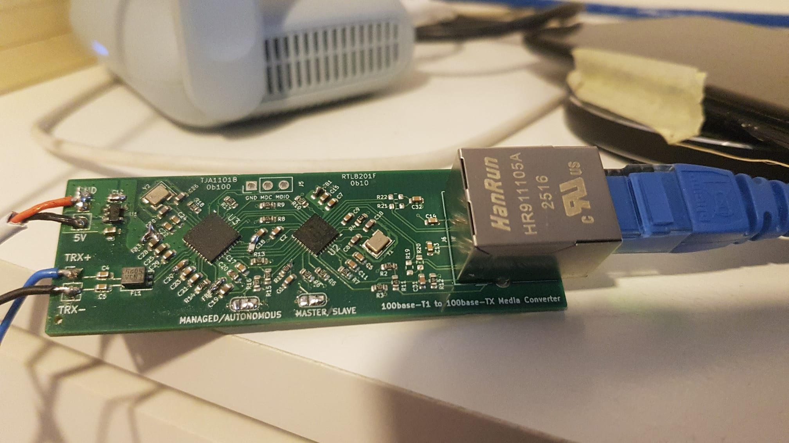
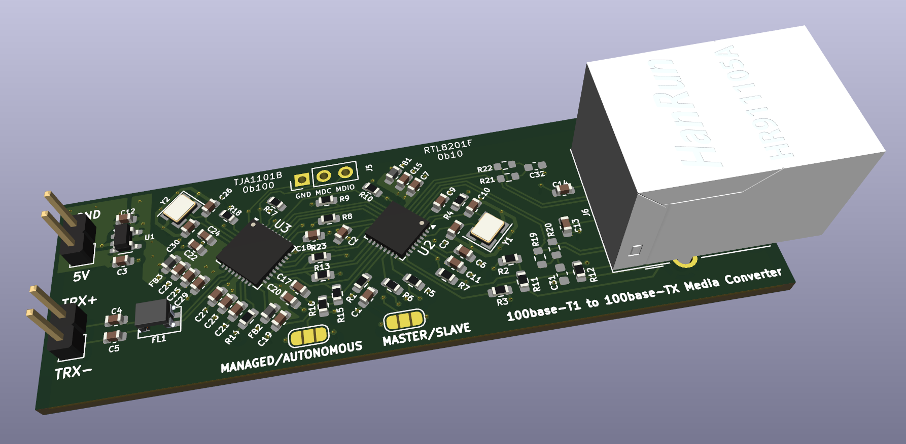

# 100base-T1-100base-TX-Media-Converter
PCB designed to convert automotive ethernet 100base-T1 to 100base-TX ethernet

This is a corrected version (the picture shows the previous revision). The correction consists of a missing resistor to set the TJA1101B MDIO address.

Another issue I had during bring up was the ferrite bead FB1, which I originally selected of incorrect value. (The TJA1101B was reporting low voltage on register 25 bits 15 and 14 (UV_VDDD_3V3 and UV_VDDA_3V3). I corrected it in the published schematic, but it is untested. On my PCB I've just shorted it.

I've tested 2 of this board with Unshielded and not twisted wire (ideally should be Twisted - UTP) of 8 meters length, reaching a speed of 85Mbps. No dropped packets were observed.
The polarity of the 2 wire ethernet doesn't really matter (the slave will correct accordingly).
After this successful test I've proceeded testing with my PandarQT 3D lidar (which only has 100base-T1 interface) successfully.

No MDIO setup is needed (the configuration is all done via strapping resistors). Just bridge the solder bridges to select autonomous mode and also master or slave as needed.
If you need MDIO interface to check / set registers, keep in mind that while in autonomous mode the MDIO interface of TJA1101B will not work. Just set it to managed.

I include the very rough Arduino sketch that I've used to interface with MDIO (bit banging)

